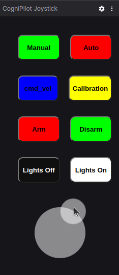
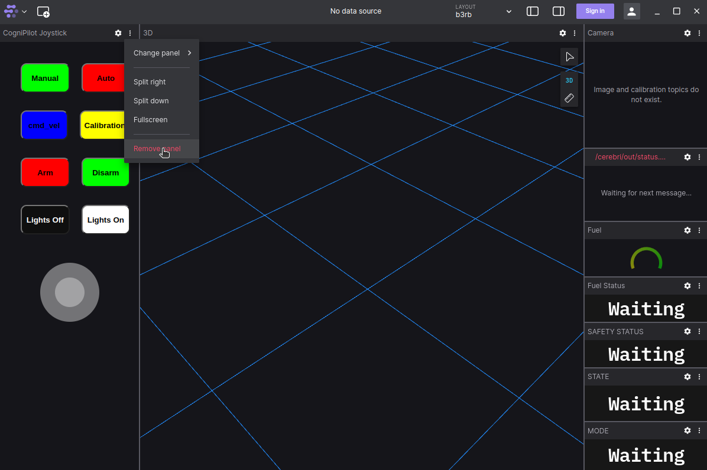
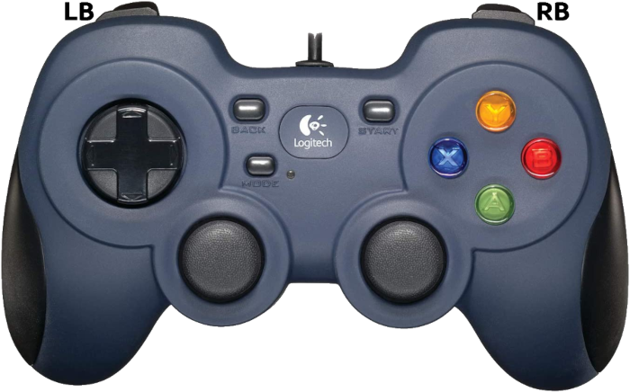

# About Electrode

Much like the name implies from the medical term, Electrode is the introspection and user interface to CogniPilot's [Cranium](../cranium/about.md) and [Cerebri](../cerebri/about.md).

Electrode is primarily a ROS 2 workspace that allows for controlling robotic platforms through either foxglove or RVIZ 2 backends.

Electrode uses a [joystick](#joy-input) whether ([virtual](#foxglove-cognipilot-joystick-extension) or [physical](#example-of-using-electrode-with-a-physical-joystick-for-b3rb)) to control platforms.

Foxglove-studio is the [recommended backend for Electrode](#foxglove-studio-backend-for-electrode).

??? question "Do I have to use a ROS 2 workspace based Electrode to control platforms?"

	No, there is a way to [use Electrode with foxglove and the CogniPilot extensions on windows and linux](#using-electrode-without-a-ros-2-workspace) that only uses websockets and does not require ROS 2 to be present on the system.


## Foxglove-studio backend for Electrode.

By default Electrode uses foxglove-studio as the backend, for foxglove-studio to connect to a physical platform or simulation `foxglove_bridge` must be running first on the target system.

### Install foxglove-studio and the [foxglove CogniPilot Joystick extension](#foxglove-cognipilot-joystick-extension)

Run the `build_foxglove` script after [following initial development system setup](../getting_started/install.md) and **follow the prompts**.

```bash title="Run build_foxglove script:"
build_foxglove
```

Proceed to using Electrode with foxglove-studio with the platforms specific layout:

* [B3RB](../reference_systems/b3rb/electrode.md#using-the-default-electrode-foxglove-studio-backend-with-b3rb) 
* [B3RB Simulation](../reference_systems/b3rb/simulation.md#run-electrode-with-the-foxglove-studio-backend-for-b3rb-simulation)


## RVIZ 2 backend for Electrode

Electrode can be optionally run with the RVIZ 2 backend, however, it requires a [physical joystick device](#example-of-using-electrode-with-a-physical-joystick-for-b3rb) for input.
```bash title="Electrode with RVIZ 2:"
ros2 launch electrode electrode.launch.py rviz2:=true
```
By default RVIZ 2 uses B3RB as the vehicle platform but can be changed with `vehicle:=<platform-name>`

* [B3RB](../reference_systems/b3rb/electrode.md#optionally-run-electrode-with-the-rviz-2-backend-for-b3rb) 
* [B3RB Simulation](../reference_systems/b3rb/simulation.md#optionally-run-electrode-with-the-rviz-2-backend-for-b3rb-simulation)

## Joy Input

Any compatible `Joy` input can be used to control the platform.

### Joy input message example for B3RB

The `sensor_msgs/Joy` message on topic `/cerebri/in/joy` controls the `b3rb`, inspect the message to see the field mappings.
``` { .yaml .annotate title="ros2 topic echo /cerebri/in/joy" }
---
header:
  stamp:
    sec: 0
    nanosec: 0
  frame_id: ''
axes:
- 0.0
- 0.0      #(1)
- 0.0
- 0.0      #(2)
buttons:
- 0        #(3)
- 0        #(4)
- 0        #(5)
- 0        #(6)
- 0        #(7)
- 0        #(8)
- 0        #(9)
- 0        #(10)
---
```

1. **Throttle** in <span style="color:green; background-color:darkgray;"> **Manual Mode** </span>.
2. **Steering** in <span style="color:green; background-color:darkgray;"> **Manual Mode** </span>.
3. <span style="color:green; background-color:darkgray;"> **Manual Mode** </span>
4. <span style="color:red; background-color:darkgray;"> **Auto Mode** </span>
5. <span style="color:blue; background-color:darkgray;"> **CMD_VEL Mode** </span>
6. <span style="color:yellow; background-color:darkgray;"> **Calibration Mode** </span>
7. Front Lights On
8. Front Lights Off
9. <span style="color:green;">**Disarm**</span>
10. <span style="color:red;">**Arm**</span>

### Foxglove CogniPilot Joystick extension

???+ tip "Install foxglove-studio and build the foxglove CogniPilot Joystick extension"

    Make sure to have first run the `build_foxglove` script at some point and **follow the prompts**.
    ```bash title="Run build_foxglove script:"
    build_foxglove
    ```

The foxglove CogniPilot Joystick extension allows users to control a platform without the need for a physical joystick.
???+ picture "Using the CogniPilot Joystick extension in foxglove."

    Use is simple, click the corresponding buttons to perform their actions. An example on B3RB, click and drag the smaller circle around for throttle (up/down) and steering (left/right).

    


??? question "Can I still use a physical josytick with foxglove?"

    A physical Joystick can still be used with foxglove but it requires closing the `CogniPilot Joystick` panel that is automatically opened when importing a layout file like the `b3rb.json` layout and running electrode with `joy:=true`
    ```bash title="Run Electrode with foxglove and physical joystick"
    ros2 launch electrode electrode.launch.py joy:=true
    ```
    

### Example of using electrode with a physical joystick for B3RB.

While most physical joysticks on the market can be made to work with ROS 2, this example highlights a [Logitech F310](https://www.logitechg.com/en-us/products/gamepads/f310-gamepad.940-000110.html).

??? picture "Logitech F310 button layout."

    

#### Selecting a Mode

* <span style="color:green; background-color:darkgray;"> **A** </span>: Manual Mode
* <span style="color:blue; background-color:darkgray;"> **X** </span>: CMD_VEL Mode (nav2)
* <span style="color:red; background-color:darkgray;"> **B** </span>: Auto Mode (other cmd_vel)
* <span style="color:yellow; background-color:darkgray;"> **Y** </span>: Calibration Mode

#### Arming

* **START**: arm
* **BACK**: disarm

#### Manual Mode

* **Left stick Up/Down**: Throttle
* **Right stick Left/Right**: Steering

#### Front Lights

* **LB**: Front lights on
* **RB**: Front lights off

## Using Electrode without a ROS 2 workspace

To use Electrode without ROS 2 on a system use foxglove-studio. 

  1. [Download the latest foxglove-studio for your system (Linux/Windows)](https://foxglove.dev/download) and install it.
  
	??? warning "If using with linux only use debian installer."

		Do not use the snap version, only follow instructions for debian linux install.

  2. Download the [latest foxglove-cognipilot-joy extension asset `cognipilot.cognipilot-joystick-<version>.zip
`  for Airy](https://github.com/CogniPilot/foxglove-cognipilot-joy/releases?q=airy&expanded=true).
  3. Unzip compressed folder and put it in correct path for operating systems foxglove-studio.	
  On Linux:
  	```bash title="Move and extract extension on Linux:"
  	mkdir -p ~/.foxglove-studio/extensions
  	mv <path-to>/cognipilot.cognipilot-joystick-*.zip ~/.foxglove-studio/extensions
  	cd ~/.foxglove-studio/extensions
  	unzip cognipilot.cognipilot-joystick-*.zip
  	```
	On Windows:
	  1. Go to `Users/<User>/` and see if there is a .foxglove-studio/extensions folder, [enable seeing hidden folders if not already enabled](https://support.microsoft.com/en-us/windows/view-hidden-files-and-folders-in-windows-97fbc472-c603-9d90-91d0-1166d1d9f4b5#:~:text=Show%20%3E%20Hidden%20items.-,Open%20File%20Explorer%20from%20the%20taskbar.,folders%2C%20and%20drives%20and%20OK.). If the folder path exists proceed to step `d.`, if not continue with step `b.`
	  2. Create a .foxglove-studio folder in `Users/<User>/`.

		??? picture "Creating a .foxglove-studio folder `Users/<User>/`."

			

	  3. Create an extensions folder in `Users/<User>/.foxglove-studio`.

		??? picture "Creating an extensions folder in `Users/<User>/.foxglove-studio`."

			

	  4. Go to location where [`cognipilot.cognipilot-joystick-<version>.zip
`](https://github.com/CogniPilot/foxglove-cognipilot-joy/releases?q=airy&expanded=true) was downloaded `right click the .zip` and select `Extract All...`

		??? picture "Select `Extract All...` on `cognipilot.cognipilot-joystick-<version>.zip`."

			

	  5. Provide extraction path to `Users/<User>/.foxglove-studio/extensions` and press extract.

		??? picture "Provide extraction path to `Users/<User>/.foxglove-studio/extensions`."

			

  4. Download desired [platform layout for foxglove by selecting the `<robot>.json` file on GitHub](https://github.com/CogniPilot/electrode/tree/airy/foxglove_layouts) and pressing the download icon.

	??? picture "Example of downloading `b3rb.json` layout for foxglove."

		

  6. Open the foxglove-studio application.

  5. Connect foxglove-studio to the correct `foxglove_bridge` websocket's `ip address` and `port` in the format `ws://<ip-address>:<port>`.

	??? picture "Connecting foxglove-studio to the correct `foxglove_bridge` websocket's `ip address` and `port`."

		
