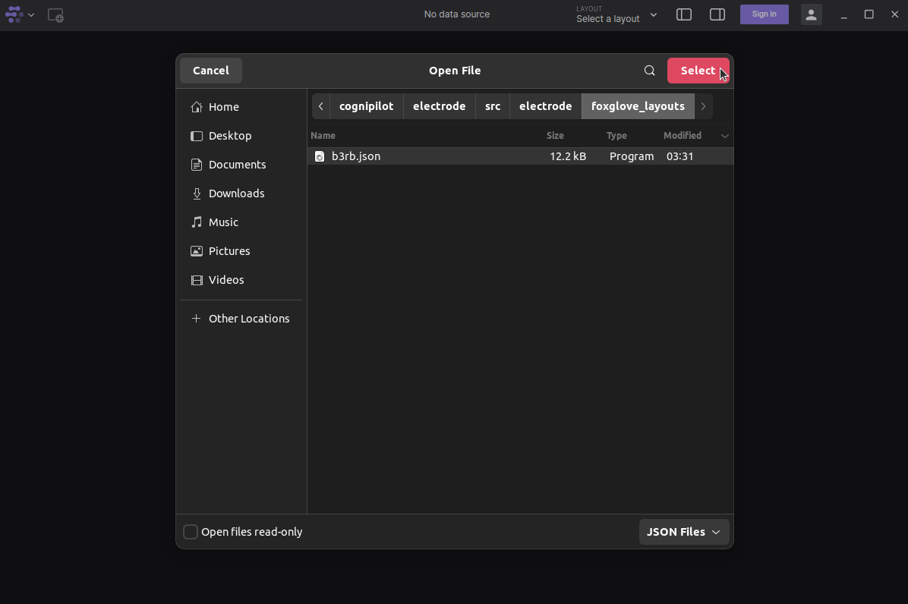
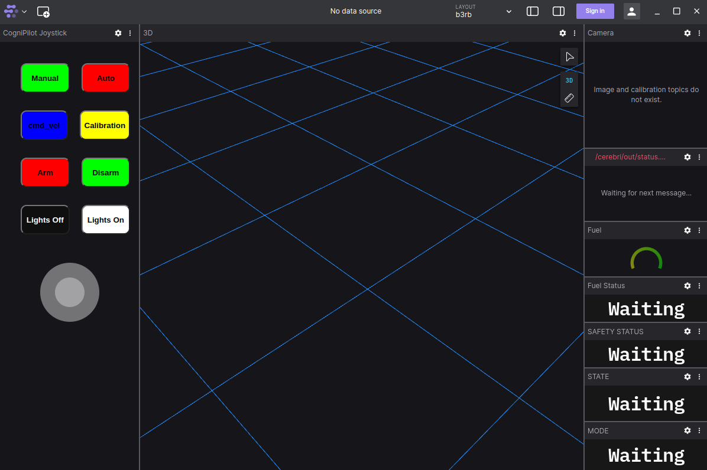

# B3RB Electrode Overview

[Electrode](../../electrode/about.md) can be run with foxglove-studio or RVIZ 2 backends for the real and [simulated B3RB](./simulation.md). Foxglove-studio is the recommended and default backend for Electrode.

Electrode uses a joystick ([virtual](../../electrode/about.md#foxglove-cognipilot-joystick-extension) or [physical](../../electrode/about.md#example-of-using-electrode-with-a-physical-joystick-for-b3rb)) to control the B3RB.

To visualize and control the B3RB it is recommended to understand the [key concepts and backend options with Electrode](../../electrode/about.md).

## Using the default Electrode foxglove-studio backend with B3RB.

???+ tip "If using the foxglove backend for Electrode."

     Make sure to have first followed instructions to [install foxglove-studio and the foxglove CogniPilot Joystick extension](../../electrode/about.md#install-foxglove-studio-and-the-foxglove-cognipilot-joystick-extension).

By default Electrode uses foxglove-studio, for foxglove-studio to connect to the B3RB or [B3RB simulation](./simulation.md#run-electrode-with-the-foxglove-studio-backend-for-b3rb-simulation) `foxglove_bridge` must be running.

On the robot's NavQPlus this happen automatically when running [`ros2 launch b3rb_bringup robot.launch.py`](https://github.com/CogniPilot/b3rb_robot/blob/eb4b7860cea8989856df36db246746e816a11146/b3rb_bringup/launch/robot.launch.py#L63-L66) and uses by default the current [network address of the WiFi `mlan0`](https://github.com/CogniPilot/b3rb_robot/blob/eb4b7860cea8989856df36db246746e816a11146/b3rb_bringup/launch/robot.launch.py#L13-L14) to instantiate the websockets over.

??? question "How do I make `foxglove_bridge` on the NavQPlus use a different network address?"

    A different [network address](https://github.com/CogniPilot/b3rb_robot/blob/eb4b7860cea8989856df36db246746e816a11146/b3rb_bringup/launch/robot.launch.py#L67-L68) can be used by passing it to the launch script.
    ```bash title="Use different network address for foxglove_bridge:"
    ros2 launch b3rb_bringup robot.launch.py address:='<other.ip.address>'
    ```
    And then connect to it in Foxglove-Studio with `ws://<other.ip.address>:4242`.

??? question "What if I don't want to run `foxglove_bridge` on the NavQPlus?"

    Appending `foxglove:=false` to the launch command will prevent `foxglove_bridge` from running.
    ```bash title="Run without foxglove_bridge:"
    ros2 launch b3rb_bringup robot.launch.py foxglove:=false
    ```

??? question "My foxglove studio connected but it's not showing what I would expect it to, how do I load the `b3rb.json` layout file?"

    1. Click the foxglove logo drop down in upper left followed by `Import layout from file...`
    
    2. Click the `b3rb.json` file followed by clicking `Select` by navigating `Home > cognipilot > electrode > src > electrode > foxglove_layouts > b3rb.json`
    
    3. The layout should now be present regardless of foxglove being connected to a websocket data source.
    

## Optionally run Electrode with the [RVIZ 2 backend](../../electrode/about.md#) for B3RB.
Electrode can be optionally run with the RVIZ 2 backend, however, it requires a [physical joystick device](../../electrode/about.md#example-of-using-electrode-with-a-physical-joystick-for-b3rb) for input.
```bash title="Electrode with RVIZ 2:"
ros2 launch electrode electrode.launch.py rviz2:=true
```

Make sure to also run without the `foxglove_bridge` on the NavQPlus.
```bash title="Run without foxglove_bridge:"
ros2 launch b3rb_bringup robot.launch.py foxglove:=false
```
